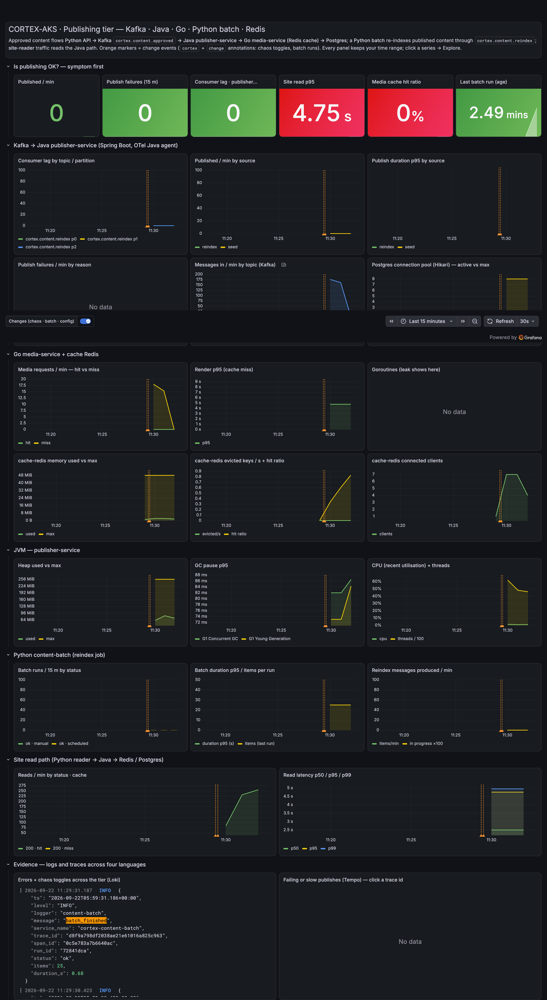

**TL;DR** You can bolt an open-source AI agent onto Grafana Cloud in an afternoon, using only two Apache-2.0 projects. It reads the same metrics, logs and traces your team reads, cites the query behind every claim, and can be swapped, audited and budgeted like any other tool. This series builds one, points it at a deliberately messy pipeline (Java, Go, Python, Kafka, Redis, a batch job) and lets it solve three real incidents.

## The itch

It is 02:10. An alert says "consumer lag high". You open Grafana, and Grafana has forty dashboards. You know the answer is in there: a metric, a log line, one trace. What you do not have at 02:10 is the patience to write the six queries that connect them.

Grafana Cloud ships a managed assistant for exactly this. It is good. But I wanted something else as well:

- an assistant whose **source I can read**,
- whose **model I can swap** (cloud today, a local model tomorrow),
- that **runs in my terminal**, next to `kubectl` and `git`,
- whose every Grafana call I can **audit and budget**.

That is an open-source problem, and it turns out the pieces already exist.

## The two pieces

**[mcp-grafana](https://github.com/grafana/mcp-grafana)** is Grafana Labs' own open-source server for the Model Context Protocol (MCP). MCP is the boring, useful standard that lets an AI agent call tools. This server turns Grafana's APIs into 81 of them: run a PromQL query, search Loki, fetch a Tempo trace, list alert rules, read annotations, create a dashboard panel. It holds your Grafana token; the model never sees it.

**[goose](https://github.com/block/goose)** is Block's open-source agent. It runs in your terminal, speaks MCP, and works with any model provider, including local models through Ollama. It is the "brain" that decides which tool to call next and turns the results into an answer.

```text
  you ──prompt──▶ goose (OSS agent) ──MCP tools──▶ mcp-grafana (OSS server) ──Grafana API──▶ Grafana Cloud
                                                       │ holds the service-account token          ├ Mimir  (metrics)
                                                                                                  ├ Loki   (logs)
                                                                                                  ├ Tempo  (traces)
                                                                                                  └ Alerting · annotations
```

Nothing here needs Grafana Assistant. (If you have it, the same MCP server can drive it too.)

## The system it will debug

A tidy demo app would make the assistant look better than it is. So the stage is [CORTEX-AKS](https://github.com/sathpal/grafana-assistant-demo), a content platform where AI agents write technical articles and a human approves them, extended with a **publishing tier** that looks like a real estate:

| Component | Language / tech | What it does |
| --- | --- | --- |
| `cortex-api` | Python, FastAPI | The human approves an article; on approve, produces a Kafka message |
| `kafka` | Apache Kafka 3.9 | Topics `cortex.content.approved`, `cortex.content.reindex`, `cortex.media.processed` |
| `publisher-service` | Java 21, Spring Boot, OpenTelemetry Java agent | Consumes both content topics, renders Markdown, calls media-service, writes Postgres, caches in Redis, serves `GET /published/{id}` |
| `media-service` | Go, OpenTelemetry Go SDK | Renders OpenGraph images, caches them in Redis, announces renders on Kafka |
| `content-batch` | Python | A scheduled reindex job: re-publishes articles in bulk through Kafka |
| `site-reader` | Python | Synthetic readers hitting the Java read path |
| `cache-redis` | Redis 7, 48 MiB, LRU | The cache tier shared by Java and Go |
| Grafana Alloy | Collector | OTLP in from every service, scrapes the Kafka and Redis exporters, ships all of it to Grafana Cloud |

Four languages, a message bus, a cache, a batch job. One trace can cross all of it, because every service propagates OpenTelemetry context, including through Kafka headers.

The humans get one dashboard for the tier. The assistant gets the same data through the API.



## The three problems

Each one is a real incident I triggered on purpose (the repo has a `make pub-chaos` command for every failure). Each is hard in a different way:

1. **"Publishing is stuck."** Approved articles stop appearing on the site. Nothing is down. The answer is a queue, and the assistant has to cross Python, Kafka, Java, Go and Redis to prove it. *(Part 3)*
2. **"What changed?"** Two configuration changes two minutes apart, and only one is the root cause. The assistant has to build a timeline from annotations, metrics and alert history and pick the trigger. *(Part 4)*
3. **The silent failure.** Kafka says consumed, dashboards are green, the site says 404. Then the assistant writes the guard rails back into Grafana: an annotation, an alert rule, a panel. *(Part 5)*

## What you need to follow along

- A Grafana Cloud stack (the free tier is enough).
- A laptop with Docker (about 2 GiB for the tier) and Go or `uvx` for the MCP server.
- An API key for one model provider, or Ollama with a local model.
- About 15 minutes for the setup in Part 2.

## The series

1. **This part.** Why, and what we are building.
2. Setup in 15 minutes: mcp-grafana + goose + Grafana Cloud.
3. "Publishing is stuck": following one article across four languages.
4. "What changed?": a timeline from annotations and alert history.
5. The silent failure, and letting the assistant write back to Grafana.
6. Guard rails: safe, cheap and honest.

Scripted walkthrough of this part: `make demo P=1` in the [demo repo](https://github.com/sathpal/grafana-assistant-demo) (narrated, with pauses; `DEMO_AUTO=1` to record).

Next up: **Part 2**, where we wire it together and run the first prompt.

---

*Everything in this series ran against a real Grafana Cloud stack on 22 September 2026. The numbers, log lines and trace ids in the screenshots are the real ones.*
