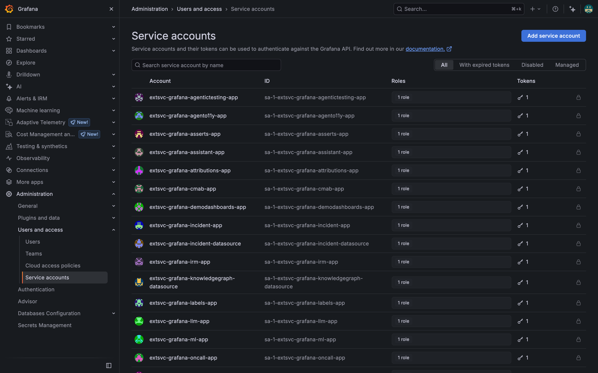
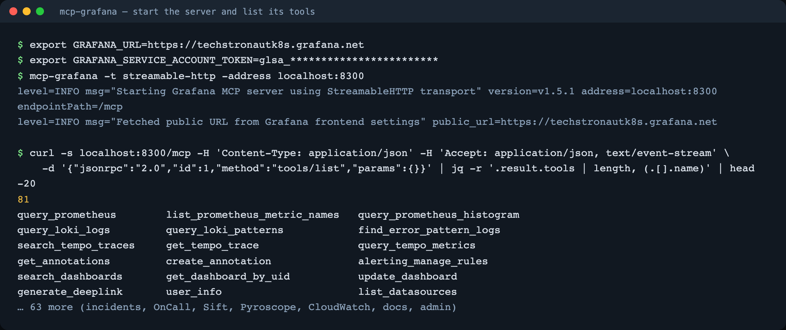
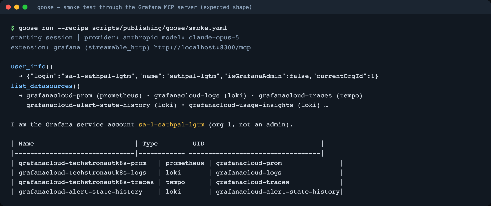

**TL;DR** One service-account token, one binary, one `brew install`, six lines of house rules, one smoke-test prompt. At the end you have an open-source agent that can query your Grafana Cloud stack and cite what it ran. Part 1 explained why; this part is the how.

## Step 1: a service account token (2 minutes)

In Grafana Cloud go to **Administration, then Users and access, then Service accounts**. Add a service account, give it a role, and add a token.

- **Viewer** is enough for investigating (Parts 3 and 4).
- **Editor** is needed only when you want the assistant to write annotations, alert rules or panels (Part 5). Make that a second token you hand out for one session, not the default.



The token is the only credential in the whole setup, and only the MCP server ever sees it.

## Step 2: run the Grafana MCP server (3 minutes)

[mcp-grafana](https://github.com/grafana/mcp-grafana) ships as a Go binary, a `uvx` package and a Docker image. Pick one:

```bash
# Go
GOBIN="$HOME/go/bin" go install github.com/grafana/mcp-grafana/cmd/mcp-grafana@latest
# or: uvx mcp-grafana       # or: docker run --rm -i -e GRAFANA_URL -e GRAFANA_SERVICE_ACCOUNT_TOKEN grafana/mcp-grafana

export GRAFANA_URL=https://<your-stack>.grafana.net
export GRAFANA_SERVICE_ACCOUNT_TOKEN=<token>

# HTTP transport, so more than one assistant (or a whole team) can share it
$HOME/go/bin/mcp-grafana -t streamable-http -address localhost:8300
```

Why port 8300? Because the app I am debugging owns 8000 on my laptop, and I lost twenty minutes to a 404 before I noticed. Pick any free port; just use the same one everywhere below.

Check it before you attach anything. `tools/list` should come back with 81 tools:



You will use maybe fifteen of them. The ones that matter for this series:

| For | Tools |
| --- | --- |
| Metrics | `query_prometheus`, `list_prometheus_metric_names`, `list_prometheus_label_values` |
| Logs | `query_loki_logs`, `query_loki_stats` |
| Traces | `search_tempo_traces`, `get_tempo_trace` |
| What changed | `get_annotations`, `alerting_manage_rules`, `grafana_api_request` |
| Writing back | `create_annotation`, `alerting_manage_rules` (create), `update_dashboard`, `generate_deeplink` |

## Step 3: install goose and attach the server (3 minutes)

```bash
brew install block-goose-cli            # other installs: github.com/block/goose
export GOOSE_PROVIDER=anthropic         # or openai, google, ollama, ...
export GOOSE_MODEL=claude-opus-5        # any model your provider offers
export ANTHROPIC_API_KEY=<key>          # or the equivalent for your provider

goose session --with-streamable-http-extension http://localhost:8300/mcp
```

Prefer the server to start and stop with the assistant? Register it as a stdio extension instead and skip the long-running process:

```bash
goose session --with-extension "grafana:GRAFANA_URL=$GRAFANA_URL GRAFANA_SERVICE_ACCOUNT_TOKEN=$GRAFANA_SERVICE_ACCOUNT_TOKEN $HOME/go/bin/mcp-grafana -t stdio"
```

`goose configure` makes either permanent (Add Extension, then Remote Extension (Streaming HTTP) or Command-line Extension).

## Step 4: six lines of house rules (2 minutes)

A general agent will happily invent a metric name. Six lines turn it into an on-call assistant. Save them as `grafana-oncall.md` and pass `--system "$(cat grafana-oncall.md)"`, or paste them as your first message:

```text
You are an on-call assistant for the CORTEX-AKS content platform (Python API, Kafka, Java publisher-service,
Go media-service, Redis cache tier, Postgres, a Python content-batch job), working only through the grafana tools.
1. Start with user_info and list_datasources so you know what you can reach.
2. Never assert a cause without a query result that shows it. Quote the PromQL, LogQL or TraceQL you ran.
3. Walk symptom to cause: business metric -> service RED metrics -> dependency metrics (Kafka lag, Redis, JVM)
   -> log lines -> a trace that crosses the languages.
4. Prefer the last 15 minutes; widen only if the signal is absent. Use get_annotations with tags
   ["cortex","change"] to see what changed.
5. Read-only unless the prompt says "write". Writes are limited to annotations, alert rules and dashboard panels;
   confirm the exact object before creating it.
6. Finish with: root cause, evidence (one line per signal, with a Grafana deep link), blast radius,
   recommended fix, confidence.
```

Rule 2 is the one that matters most. It is the difference between "probably Kafka" and "`kafka_consumergroup_lag{consumergroup="publisher-service"}` is 4,533 on `cortex.content.reindex`".

## Step 5: the smoke test (1 minute)

First prompt in the session:

```text
Using the grafana tools: tell me which Grafana credential you are, then list the data sources
(name, type, uid) in one short table. Do nothing else.
```

The first tool call must be `user_info`, and it must come back with your service account. Then `list_datasources` should show the Cloud Mimir, Loki and Tempo data sources. If the assistant answers from memory instead of calling a tool, the extension is not attached; `goose session` prints the extension name at start-up, check it is there.



(That screenshot is the expected shape of the run; the `user_info` and `list_datasources` results in it are the real ones from my stack.)

## Self-hosted Grafana OSS instead of Cloud?

Everything above works unchanged against a self-hosted, fully open-source Grafana. The demo repo ships an optional
`grafana/otel-lgtm` container (Grafana OSS, Prometheus, Loki, Tempo) and a second Alloy config that sends the same
telemetry to both. Three commands:

```bash
make oss-up        # Grafana OSS on localhost:3001, Alloy fans out to Cloud and local
make grafana-oss   # same dashboard and alert rules, pushed locally
make mcp-oss &     # a second mcp-grafana on :8310, basic-auth against the local Grafana
```

Then `GRAFANA_TARGET=oss` in front of any demo or audit. The datasource UIDs become `prometheus`, `loki` and `tempo`
and the credential becomes a username and password; the metric names, labels, trace ids, recipes and house rules are
identical. That is the "no lock-in" claim from Part 1, tested.

## Step 6: make it repeatable with recipes (2 minutes)

goose recipes are YAML files that carry the system prompt, the user prompt and the extensions, so an investigation is one command and lives in git next to the code. The repo ships four:

```yaml
# assistant/recipes/problem1.yaml (abridged)
version: 1.0.0
title: "Problem 1: approved articles stop appearing on the site"
instructions: |
  <the six house rules above>
prompt: |
  Approved articles stopped appearing on the site about ten minutes ago ...
extensions:
  - type: streamable_http
    name: grafana
    uri: http://localhost:8300/mcp
    timeout: 300
```

```bash
goose run --recipe assistant/recipes/smoke.yaml
goose run --recipe assistant/recipes/problem1.yaml   # Parts 3, 4 and 5 each have one
```

## If something is off

| Symptom | Cause | Fix |
| --- | --- | --- |
| The assistant "knows" the answer without calling a tool | extension not attached | check the extension line at session start; re-run with `--with-streamable-http-extension` |
| `404 Not Found` on every call | wrong port, or something else on it | `curl localhost:8300/mcp ...` as in Step 2 |
| Writes fail with 403 | Viewer token | use the Editor token for that session only |
| Times are off by hours | timestamps without an offset are UTC | ask for relative ranges (`now-15m`) |
| `histogram_quantile` returns `NaN` | histogram has no buckets, or the wrong ones | fix the instrumentation, not the prompt (Part 6 has the story) |

Scripted walkthrough of this part: `make demo P=2` in the [demo repo](https://github.com/sathpal/grafana-assistant-demo) (narrated, with pauses; `DEMO_AUTO=1` to record).

Next up: **Part 3**, where editors say "publishing is stuck" and the assistant follows one article across Python, Kafka, Java, Go and Redis.
