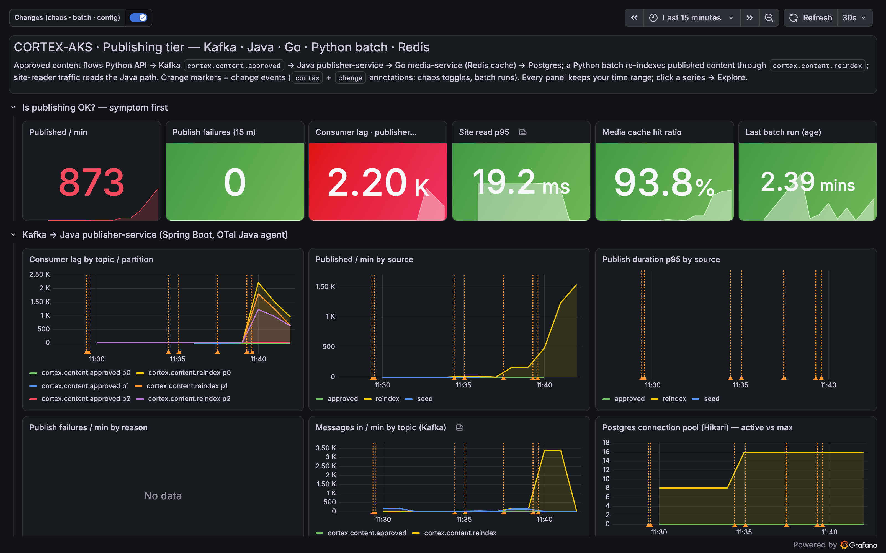
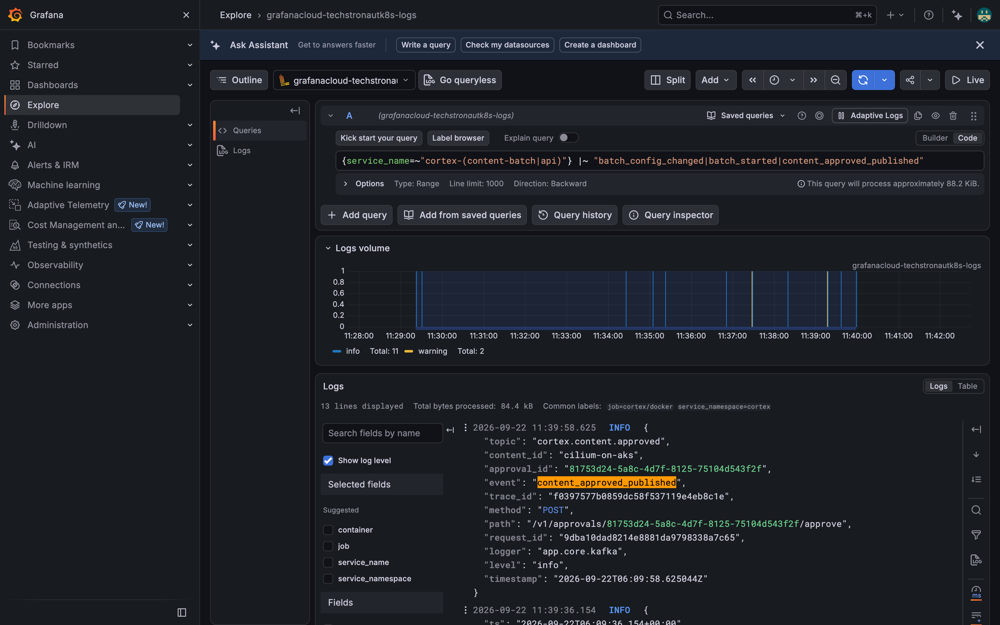
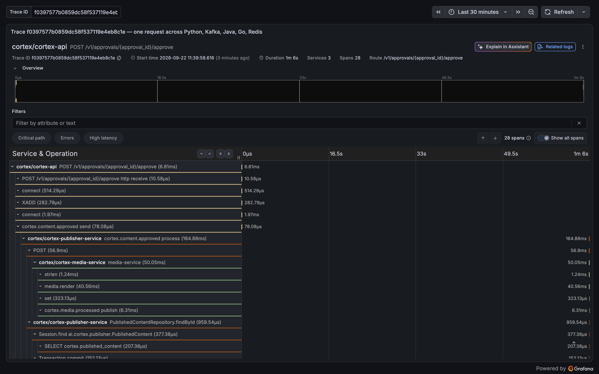
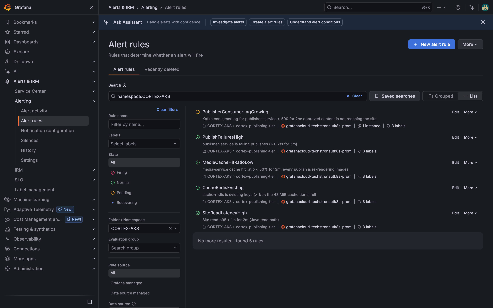

**TL;DR** Editors approve an article; it never shows up. Nothing is down. In nine tool calls the assistant proves that a batch job's config change is flooding the Kafka topics a single Java consumer serves, so every approved article waits about a minute in the queue. The proof is one trace: 66 seconds waiting, 165 milliseconds of actual work across Python, Java, Go, Redis and Postgres.

If you skipped Part 2: the assistant is [goose](https://github.com/block/goose) talking to Grafana Cloud through [mcp-grafana](https://github.com/grafana/mcp-grafana), with six lines of house rules that force it to cite every query.

## The incident

I switch the batch job into its "month-end" mode and, while it runs, approve an article through the Python API:

```bash
make pub-chaos S=batch-flood     # batch_size 25 -> 3000, concurrency 4 -> 32, runs now and every 5 minutes
# ... approve an article (slug cilium-on-aks) ...
curl -s -o /dev/null -w '%{http_code}\n' localhost:8085/published/cilium-on-aks
404
```

The chaos script writes a Grafana annotation for the config change (tags `cortex`, `change`), and the batch annotates each run. That is the only breadcrumb the assistant gets. Nobody tells it about the batch.

This is what the humans see. Lag is red, everything else is green.



## The prompt

```text
Approved articles stopped appearing on the site about ten minutes ago; editors say publishing is "stuck".
Find the root cause across the whole path: Python API -> Kafka (cortex.content.approved / cortex.content.reindex)
-> Java publisher-service -> Go media-service -> Redis cache -> Postgres. Use metrics (Kafka consumer lag,
publisher rates and latency, media cache hit ratio), the cortex change annotations, Loki logs from the cortex-*
services, and one Tempo trace that crosses the languages. Cite the exact query behind every claim and finish
with root cause, evidence per signal, blast radius, recommended fix and your confidence.
```

## What the assistant does, call by call

These are the tool calls the MCP server received, with the values each returned at 06:15 UTC. Your numbers will differ; the shape will not.

| # | Tool | Query | Came back |
| --- | --- | --- | --- |
| 1 | `get_annotations` | tags `cortex`, `change`, last 30 min | 06:07 `batch config: batch_size 25 -> 3000, concurrency 4 -> 32`; runs at 06:09 and 06:14, `3000 items` each |
| 2 | `query_prometheus` | `sum by (topic) (kafka_consumergroup_lag{consumergroup="publisher-service"})` | `reindex` 1,450, `approved` 0 |
| 3 | `query_prometheus` | `max_over_time(sum(kafka_consumergroup_lag{...})[15m:])` | peak 5,249 |
| 4 | `query_prometheus` | `sum by (source) (rate(publisher_content_published_total[2m])) * 60` | reindex 992/min, approved **0**/min |
| 5 | `query_prometheus` | `sum by (topic) (rate(kafka_topic_partition_current_offset{topic=~"cortex.*"}[2m])) * 60` | 1,714 msg/min arriving on `reindex` |
| 6 | `query_prometheus` | media hit ratio, Redis fill, site p95, JVM heap, `kafka_consumergroup_members` | 1.0, 19 %, 10 ms, 34 %, **1 member** |
| 7 | `query_loki_logs` | `{service_name="cortex-content-batch"} \|~ "batch_config_changed\|batch_started"` | `batch_started run_id=025dd5c3 items=3000 concurrency=32` |
| 8 | `query_loki_logs` | `{service_name=~"cortex-(api\|publisher-service)"} \|= "cilium-on-aks"` | API: `content_approved_published trace_id=f0397577...`; Java: `published cilium-on-aks` 66 s later |
| 9 | `get_tempo_trace` | `f0397577b0859dc58f537119e4eb8c1e` | send at +0.01 s, Java `process` at +65.84 s, then 165 ms of work |

Three things worth noticing:

- **The annotation is the shortcut.** Call 1 alone points at the batch. Without change data the assistant still gets there through calls 2 to 5, but it stays a guess until call 7 confirms it.
- **It ruled the downstream out with numbers, not vibes.** Call 6 is one call with five expressions. Media cache, Redis, JVM, CPU and the read path are healthy, so the slowness is in the queue, not in the work.
- **It found the design flaw, not just the trigger.** One consumer serving two topics means the batch and the editors share a single lane. That is the fix, not "run the batch at night".

## The pivot: a trace id in a log line

Call 8 is where logs become traces. The Python API's log line for the approval carries the trace id; the Java consumer's line, a minute later, carries the same one. The assistant took that id and fetched exactly that trace instead of searching.



## The trace that ends the argument

Three services, 28 spans, 1 minute 6 seconds. The Python `send` is at the far left. The Java `process` span, the Go `media-service` span and the Postgres insert are all crammed into the last 165 ms on the far right. Everything in between is the message sitting in Kafka.



This is only possible because trace context crosses Kafka: the Python producer (aiokafka instrumentation) puts `traceparent` in the message headers, the OpenTelemetry Java agent reads it in the consumer, and the Go service propagates it on. Part 6 comes back to this.

## What the assistant reports

```text
Root cause: a batch configuration change at 06:07 (batch_size 25 -> 3000, concurrency 4 -> 32) makes
content-batch produce ~3,000 messages on cortex.content.reindex every 5 minutes. publisher-service consumes
both content topics with one consumer (kafka_consumergroup_members = 1), so approved articles queue behind
the reindex backlog. Peak lag 5,249; drain rate ~1,000/min; an approval waits ~60-90 s.

Evidence
- Change:  06:07:27 batch config change; runs 06:09:16, 06:14:37 (3000 items).
- Metrics: lag reindex 1,450 (peak 5,249), approved 0; published reindex 992/min, approved 0/min;
           downstream healthy: media hit ratio 1.0, cache-redis 19 %, JVM heap 34 %, site read p95 10 ms.
- Logs:    batch_started run_id=025dd5c3 items=3000; api content_approved_published cilium-on-aks ->
           java published cilium-on-aks 66 s later, same trace_id.
- Trace:   f0397577...: send +0.01 s, Java process +65.84 s, media-service 50 ms, Postgres insert 2 ms.

Blast radius: every approved article while a batch run drains (~3 of every 5 minutes). Readers unaffected.
Fix now: revert the batch config. Fix properly: a separate consumer group for cortex.content.approved, and
listener concurrency = partition count. Alert PublisherConsumerLagGrowing already covers the symptom.
Confidence: high. Change, metrics, logs and the trace agree, and the downstream is provably idle.
```

Grafana agreed. The lag rule went pending two minutes into the flood and fired during the investigation; the other four rules stayed normal, which is the same "downstream is healthy" conclusion the assistant reached in call 6.



## Try it

```bash
make demo P=3   # the scripted, narrated version of everything below
make pub-chaos S=batch-flood
goose run --recipe assistant/recipes/problem1.yaml
make pub-chaos S=batch-flood ON=off
```

(The tool calls above were made through the MCP server directly; the recipe runs the same investigation end to end with whichever model you configured in Part 2.)

Next up: **Part 4**, two config changes two minutes apart, and only one of them is the root cause.
