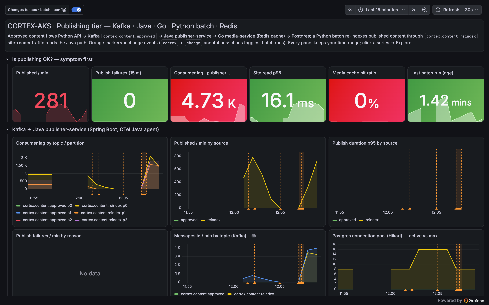
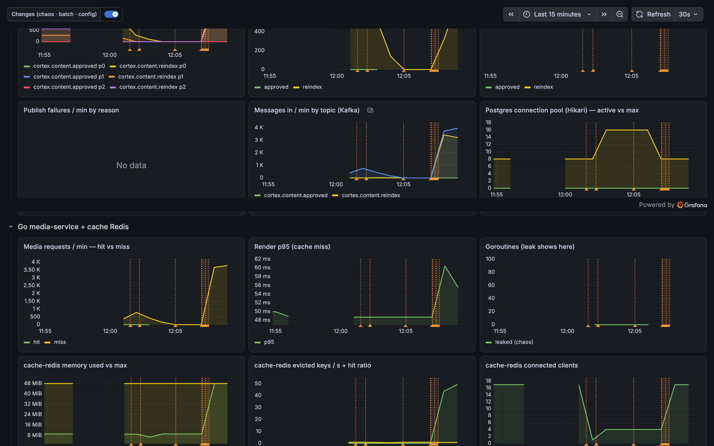
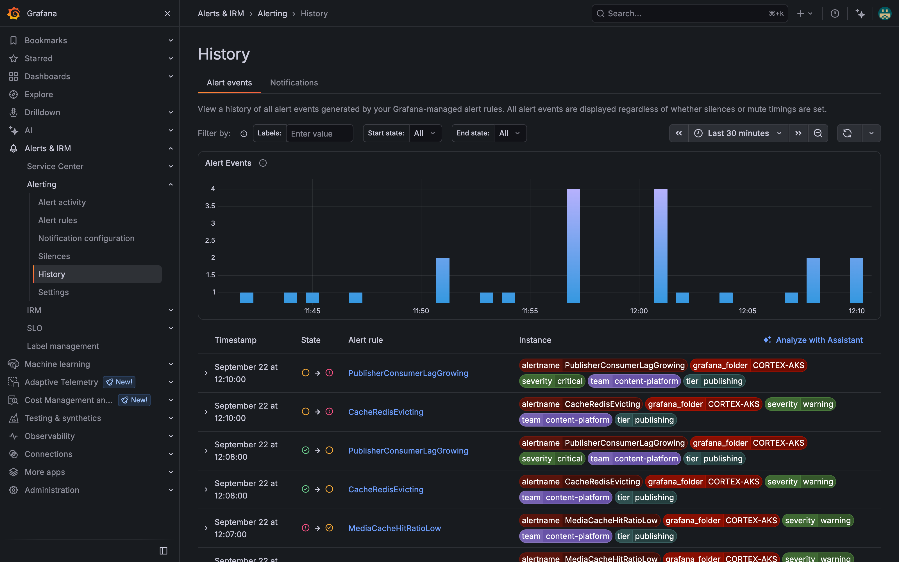

<!--
MEDIUM PUBLISHING NOTES (delete this block before pasting)

Recommended: publish on dev.to first, then in Medium use "Import a story"
(medium.com/p/import) with the dev.to article URL. Medium pulls the rendered
HTML, images and code blocks, and sets the canonical link to dev.to
automatically, which avoids duplicate-content penalties.

Manual alternative: paste the text below into the Medium editor. Medium
converts #, ##, **bold**, `code`, ``` blocks and > quotes on paste. Upload the
images from img/ where the placeholders are. Then set Story settings >
Advanced > canonical link to the dev.to URL.
-->

# "What changed?": the assistant builds a timeline from annotations and alert history (Part 4 of 6)

**TL;DR** Two configuration changes, two minutes apart. Both are visible in Grafana. Only one is the root cause. The assistant orders the evidence by *first breach time*, reads the alert history like an engineer scrubbing a dashboard, and picks the earlier, quieter change: a Go service told to cache images without a TTL. The batch that came after only made it visible. Reverting the batch alone would not have fixed it.

## The incident

This time I make two changes on purpose and say nothing:

```bash
make pub-chaos S=no-ttl               # 06:35  media-service (Go) stores images in Redis with no expiry
sleep 120
make pub-chaos S=batch-flood-media    # 06:37  full reindex with force_media: 3,000 forced image re-renders
```

Both write `cortex` + `change` annotations. Within 30 seconds the 48 MiB cache tier is full, evicting 33 keys a second, the image cache hit ratio is 0 % and the Java consumer is 3,000 messages behind.



## The prompt

```text
Publishing latency and cache-redis evictions both went up in the last 20 minutes. Build the timeline: which cortex
change annotations happened, in what order did the signals break (cache-redis memory and evictions, media-service hit
ratio and render rate, publisher-service publish p95 and Kafka lag, site read latency), and which change is the most
likely trigger? Also tell me which of the alert rules in folder CORTEX-AKS fired and when. Present the timeline as a
table with timestamps, then the verdict and the fix.
```

## How it works out the order

This is a different kind of question from Part 3. There the assistant needed *values*; here it needs *times*. So it switches `query_prometheus` to `queryType: range` with 15-second steps and reads the first timestamp at which each condition became true. That is exactly what you do with a mouse on a dashboard; the assistant does it with nine calls.

| # | Tool | What it asked | What it learned |
| --- | --- | --- | --- |
| 1 | `get_annotations` | tags `cortex`, `change`, last 30 min | 06:35:00 `config: media-service no-ttl=on`; 06:37:01 batch config change; batch runs 06:37:02 and 06:37:19 (3,000 items each) |
| 2 | `query_prometheus` (range) | `sum(rate(media_requests_total{result="miss"}[1m]))*60` | renders jump to 2,200/min at 06:37 |
| 3 | `query_prometheus` (range) | `max(redis_memory_used_bytes) / max(redis_memory_max_bytes)` | first > 90 % at **06:37:30** |
| 4 | `query_prometheus` (range) | `sum(rate(redis_evicted_keys_total[1m]))` | first > 1/s at **06:37:30** (32.7/s) |
| 5 | `query_prometheus` (range) | `sum(kafka_consumergroup_lag{consumergroup="publisher-service"})` | first > 500 at **06:37:30** (2,970) |
| 6 | `query_prometheus` | media hit ratio, site reads by cache result, site p95 | 0, 205/min hits vs 70/min misses, 15 ms |
| 7 | `query_loki_logs` | `{service_name=~"cortex-(media-service\|content-batch)"} \|~ "chaos_toggle\|batch_config_changed"` | Go: `06:35:00 chaos_toggle scenario=no-ttl on=true`; Python: `06:37:01 batch_config_changed` |
| 8 | `query_loki_logs` on the alert-state-history data source | `{from="state-history"} \| json \|= "cortex"` | lag and eviction rules Pending 06:38, Alerting 06:40 |
| 9 | `alerting_manage_rules` | list, folder `CORTEX-AKS` | 2 pending/firing, 3 normal, none paused |

Call 8 is a small trick worth stealing: Grafana Cloud stores alert state history in a Loki data source, so the same `query_loki_logs` tool that reads application logs can read "which rule went Pending when".

## The timeline it produced

| Time (UTC) | Event | Source |
| --- | --- | --- |
| 06:31:32 | all chaos scenarios reset; tier healthy | annotation |
| 06:35:00 | **change:** media-service `no-ttl=on` | annotation + Loki `chaos_toggle` |
| 06:37:01 | **change:** batch 25 -> 3,000 items, concurrency 32, `force_media` on | annotation + Loki `batch_config_changed` |
| 06:37:02 to 06:37:35 | two batch runs: 6,000 forced renders requested | annotations, `batch_started` |
| 06:37:15 | media renders 2,200/min; image hit ratio 0 % | `media_requests_total` |
| 06:37:30 | cache-redis at 100 % of 48 MiB; evictions 33/s | `redis_memory_used_bytes`, `redis_evicted_keys_total` |
| 06:37:30 | publisher lag 2,970 | `kafka_consumergroup_lag` |
| 06:38:00 | `PublisherConsumerLagGrowing`, `CacheRedisEvicting` pending | alert state history |
| 06:40:00 | both firing | alert state history |
| unchanged | site read p95 8 to 16 ms; reads still 75 % cache hits | `site_reader_*` |

On the dashboard the same story is one row: memory hits the ceiling the moment the forced renders start, evictions begin in the same 15-second bucket, and the goroutine count stays flat, so this is not the Go service leaking.



And Grafana's own alert history, the assistant's call 8, read by a human: pending at 12:08 local time, firing at 12:10, for both the lag rule and the eviction rule.



## The verdict

```text
Verdict: the trigger is the 06:35 media-service configuration change (no-ttl=on). It made every rendered image a
permanent 20 KiB resident of a 48 MiB cache tier sized for a rolling window, not the full catalogue
(300 articles x 10 channel variants x 20 KiB = 60 MiB). The 06:37 batch (force_media) is the amplifier: it
re-rendered every variant at once and filled the tier in under 30 s. Nothing broke until both were true.

Order of breakage: renders/min (06:37:15) -> cache-redis full + evicting (06:37:30) -> consumer lag (06:37:30)
-> alerts pending (06:38) -> firing (06:40). Site reads were protected: the LRU kept the hot published:* keys
and evicted cold image blobs, so p95 stayed under 20 ms.

Why not the batch alone: the same batch ran twice in Part 3 with TTLs in place and never moved
redis_memory_used_bytes above 19 %.

Fix now: revert no-ttl, then the batch config. Fix properly: enforce a TTL in media-service regardless of
config (a missing TTL is a bug, not a setting); size cache-redis for catalogue x variants, or cap force_media
batches to one variant per run; add a "keys without TTL" check so the next config change is caught before a
batch amplifies it.
Confidence: high. Annotation order, first-breach order and alert history agree, and Part 3's batch with TTLs
is the counter-example that rules the batch out as root cause.
```

The line I like most is the counter-example. The assistant did not just correlate; it remembered that the same batch had run before without harm and used that to separate trigger from amplifier.

## Try it

```bash
make demo P=4   # the scripted, narrated version of everything below
make pub-chaos S=no-ttl; sleep 120; make pub-chaos S=batch-flood-media
goose run --recipe assistant/recipes/problem2.yaml
make pub-chaos S=reset
```

Next up: **Part 5**, the failure with no symptoms at all, and the assistant's first writes back into Grafana.


*Part of the series [An Open-Source AI Assistant for Grafana Cloud](https://github.com/sathpal/grafana-articles). Code and demos: [grafana-assistant-demo](https://github.com/sathpal/grafana-assistant-demo).*
