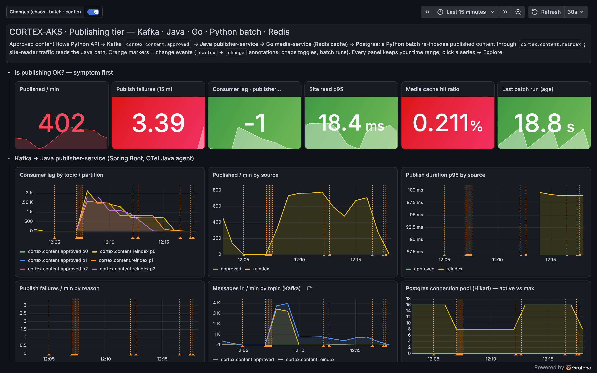
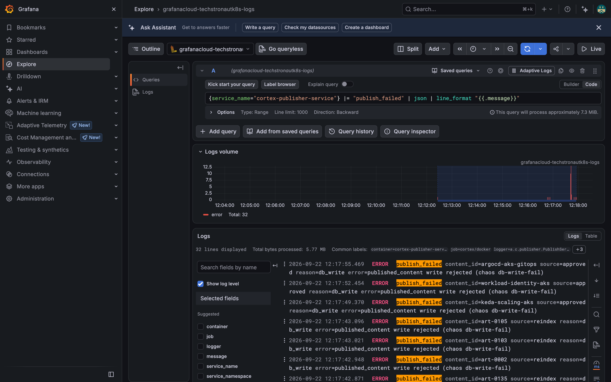
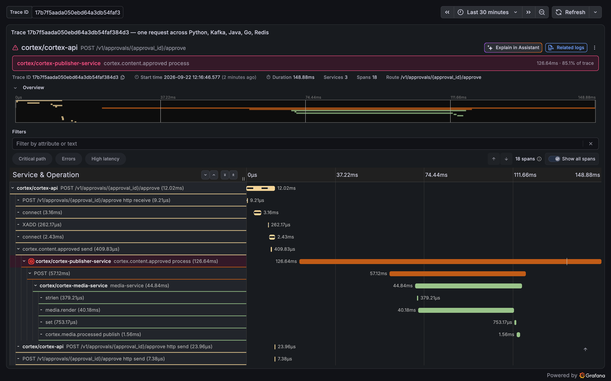
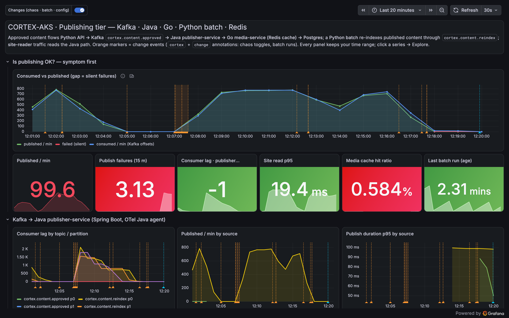
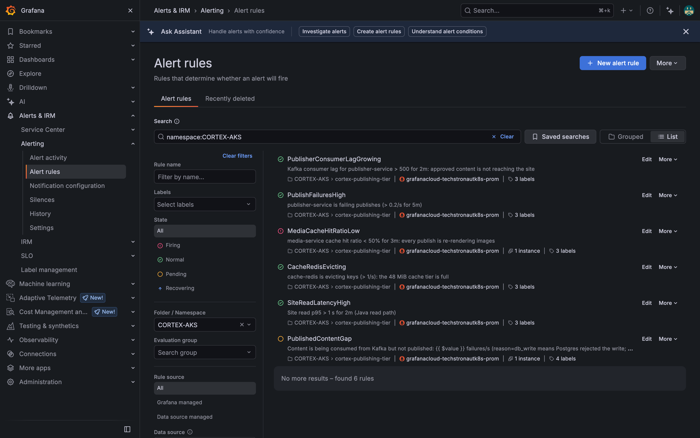

**TL;DR** Kafka says consumed. Lag is zero. The JVM is idle. The site serves cached pages in 19 ms. And six approved articles do not exist. The assistant finds the acknowledge-then-fail bug from a failure counter, one `ERROR` line per article and a single red span inside a green trace. Then, for the first time in this series, it writes to Grafana: an annotation, an alert rule and a dashboard panel, so the next time this happens someone gets paged.

## The incident

One config change, three approvals:

```bash
make pub-chaos S=db-write-fail   # publisher-service: the Postgres INSERT is rejected; the consumer still commits its offset
# approve three articles through the API: keda-scaling-aks, workload-identity-aks, argocd-aks-gitops
curl -s -o /dev/null -w '%{http_code}\n' localhost:8085/published/keda-scaling-aks
404      # and it stays 404
```

This is the trap. Lag `-1` (nothing waiting), read latency fine, a small red failure stat that nobody had on the top row, and every other panel normal.



## The prompt

This one asks for writes, so the session uses the Editor token from Part 2.

```text
Editors approved several articles in the last 10 minutes; Kafka shows them consumed and the dashboards are green,
but GET /published/{id} returns 404 for the new ids. Find out why (publisher-service metrics by reason, Loki lines
from cortex-publisher-service, a Tempo trace with status=error), name the exact failure. Then WRITE three things to
Grafana: (1) an annotation tagged cortex, rca, component:cortex-publisher-service on dashboard cortex-publishing-tier
summarising the root cause; (2) an alert rule in folder CORTEX-AKS named PublishedContentGap that fires when
rate(publisher_publish_failures_total[5m]) > 0 for 2m, severity critical, with a summary a first-line engineer can
act on; (3) a new timeseries panel on dashboard cortex-publishing-tier titled "Consumed vs published (gap = silent
failures)" comparing published/min with failed/min. Confirm each write with its URL.
```

## Finding it: consumed minus published

The trick the assistant lands on is arithmetic. Kafka offsets tell you what was *consumed*; the publish counter tells you what was *persisted*. When the first moves and the second does not, content is being lost.

| # | Tool | Query | Came back |
| --- | --- | --- | --- |
| 1 | `query_prometheus` | `sum by (topic) (kafka_consumergroup_lag{consumergroup="publisher-service"})` | 0 on both topics |
| 2 | `query_prometheus` | `sum by (topic) (increase(kafka_consumergroup_current_offset{...}[3m]))` | +4 on `approved`, +27 on `reindex` |
| 3 | `query_prometheus` | `sum by (source) (increase(publisher_content_published_total[3m]))` | 0 and 0 |
| 4 | `query_prometheus` | `publisher_publish_failures_total` | `{reason="db_write", source="approved"}` 6, `{reason="db_write", source="reindex"}` 25 |
| 5 | `get_annotations` | tags `cortex`, `change` | 06:46:30 `config: publisher-service db-write-fail=on` |
| 6 | `query_loki_logs` | `{service_name=~"cortex-(publisher-service\|api)"} \|~ "publish_failed\|content_approved_published"` | per slug: the API's approval line, then 3 s later `publish_failed content_id=keda-scaling-aks source=approved reason=db_write error=published_content write rejected`, same `trace_id` |
| 7 | `query_loki_logs` | `sum by (service_name) (count_over_time({service_namespace="cortex"} \| json \| level=~"ERROR\|error" [10m]))` | 32 errors, all on `cortex-publisher-service` |
| 8 | `search_tempo_traces` | `{ resource.service.name="cortex-publisher-service" && status=error }` | three traces, one error span each |
| 9 | `get_tempo_trace` | `17b7f5aada050ebd64a3db54faf384d3` | the Java `process` span is `ERROR db_write` with an exception event; the Go call inside it *succeeded* |
| 10 | `alerting_manage_rules` | list, folder `CORTEX-AKS` | `PublishFailuresHigh` normal: its threshold (0.2/s) was tuned for a flood, not six lost articles |

The log lines from call 6, one per article. Reason and error text come straight from the exception the Java service caught, and the batch's reindex items fail the same way.



The trace from call 9. Eighteen spans, 149 ms. The Java consumer span is red; its Go child (render, Redis SET, Kafka publish) is green. The work was done, then thrown away. This is the shape of every acknowledge-then-fail bug you will ever meet.



## Writing back

Three more tool calls, all through the same MCP server, all attributable to the service account:

| # | Tool | What it created |
| --- | --- | --- |
| 11 | `create_annotation` | an `rca` marker on the Publishing tier dashboard with the root cause and the fix |
| 12 | `alerting_manage_rules` (`create`) | `PublishedContentGap`: `sum(rate(publisher_publish_failures_total[5m])) > 0` for 2m, critical, with a summary that explains what "404 with zero lag" means |
| 13 | `update_dashboard` (`operations: [{op: add, path: $.panels/-, ...}]`) | a panel "Consumed vs published (gap = silent failures)" with three series: Kafka offsets consumed/min, rows published/min, failures/min |

Here is the dashboard afterwards. The new panel sits at the top of the symptom row, and the annotation marker (light blue, 12:20 local) is on every time axis.



And the new rule, already pending one minute after creation, next to the five that were there before.



## The report

```text
Root cause: since the 06:46:30 configuration change (publisher-service db-write-fail=on) every publish fails at
the Postgres INSERT into published_content, but the Kafka listener has already done the work and commits the
offset regardless. Failures: 6 approved articles + 25 reindex items in 10 minutes, all reason=db_write.
Nothing is queued, so lag-based alerts cannot see it.

Evidence
- Metrics: kafka_consumergroup_current_offset advanced (+4 approved, +27 reindex in 3m) while
  publisher_content_published_total did not move; publisher_publish_failures_total{reason="db_write"} = 31.
- Change:  annotation 06:46:30 config: publisher-service db-write-fail=on.
- Logs:    {service_name="cortex-publisher-service"} |= "publish_failed" -> "published_content write rejected",
           one line per article, same trace_id as the API's content_approved_published line.
- Trace:   17b7f5aada050ebd64a3db54faf384d3: cortex.content.approved process = ERROR db_write; media-service OK.

Blast radius: every approval and every batch item since 06:46:30 (31 so far). Readers unaffected.
Fix now: revert the config and re-drive the six approvals. Fix properly: commit the offset only after the
Postgres write (manual ack), or route failed items to a dead-letter topic with an alert on it.
Writes: annotation #57 on /d/cortex-publishing-tier; alert rule PublishedContentGap in folder CORTEX-AKS;
panel "Consumed vs published (gap = silent failures)" on /d/cortex-publishing-tier (version 4).
Confidence: high.
```

## Why the writes matter

An assistant that only reads leaves you with a chat transcript. One that can write, inside a narrow allow-list (annotations, alert rules, panels) and with a token you hand out per session, leaves you with a better Grafana than you had before the incident. The next engineer opens the dashboard and sees the marker, the panel and the rule. That is the difference between an answer and an improvement.

## Try it

```bash
make demo P=5   # the scripted, narrated version of everything below
make pub-chaos S=db-write-fail        # then approve a few articles through the API
goose run --recipe assistant/recipes/problem3.yaml   # with the Editor token in GRAFANA_SERVICE_ACCOUNT_TOKEN
make pub-chaos S=db-write-fail ON=off
```

Next up: **Part 6**, everything the assistant got wrong along the way, the controls that keep it safe and cheap, and the five things that made the difference.
